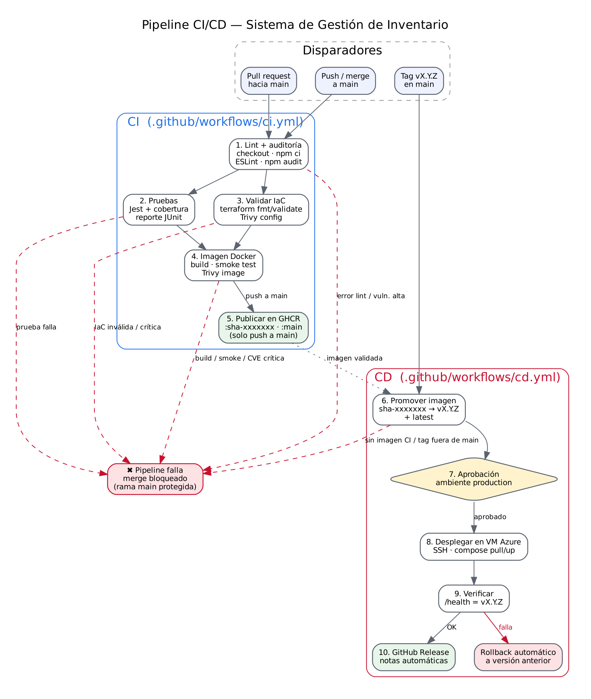

# Pipeline CI/CD

Fuente editable: [`pipeline.dot`](pipeline.dot) (`dot -Tpng -Gdpi=150 docs/pipeline.dot -o docs/img/pipeline.png`).

## CI — `.github/workflows/ci.yml`

| Disparador | Efecto |
|---|---|
| `pull_request` → `main` | Corre todas las etapas; la imagen se construye pero **no** se publica. Resultado obligatorio para el merge. |
| `push` → `main` | Igual, y publica la imagen `:sha-xxxxxxx` y `:main` en GHCR. |
| `workflow_dispatch` | Ejecución manual. |

| # | Job | Pasos | Condición de falla |
|---|---|---|---|
| 1 | Lint y auditoría | checkout, setup-node (caché), `npm ci`, ESLint, `npm audit` | Errores o advertencias de ESLint; vulnerabilidad alta/crítica en dependencias |
| 2 | Pruebas | `npm test` (Jest + Supertest), artefactos JUnit y cobertura, resumen | Cualquier prueba fallida |
| 3 | Validar IaC | `terraform fmt -check`, `init -backend=false`, `validate`, Trivy config | Formato o sintaxis inválida; hallazgo crítico no justificado en Dockerfile/Terraform |
| 4 | Imagen | Buildx con caché, prueba de humo `/health`, Trivy image, push GHCR | Build fallido, contenedor no saludable, CVE crítica corregible |

Las etapas 2 y 3 corren en paralelo tras la 1; la 4 requiere ambas (`needs`). Si una falla, las dependientes no se
ejecutan y la protección de `main` bloquea el merge.

## CD — `.github/workflows/cd.yml`

| Disparador | Efecto |
|---|---|
| `push` de tag `v*.*.*` | Libera esa versión |
| `workflow_dispatch` con `version` | Redespliega una versión existente (rollback manual) |

| # | Job | Pasos | Condición de falla |
|---|---|---|---|
| 5 | Promover imagen | Verifica que el tag esté en `main`; retaguea `sha-xxxxxxx` → `vX.Y.Z` y `latest` sin reconstruir | Tag fuera de `main`; el commit no tiene imagen validada por CI |
| 6 | Desplegar (ambiente `production`) | **Aprobación manual**, `scp` del compose, `ssh`: login GHCR, actualiza `.env`, `compose pull/up`, limpieza | Error SSH, pull o arranque |
| 7 | Verificar | Consulta `APP_URL/health` hasta obtener la versión esperada (150 s) | Versión no responde → **rollback automático** a la imagen anterior |
| 8 | Release | `gh release create` con notas generadas | — |

**Principio "build once, deploy many":** la imagen que se despliega es exactamente la misma que pasó el CI
(mismo digest), solo cambia la etiqueta.
